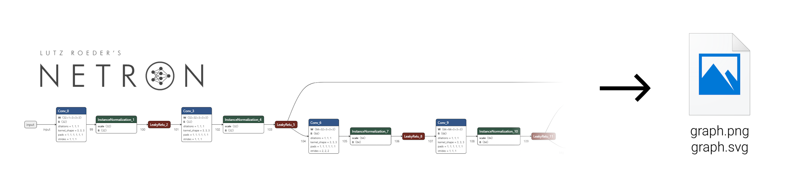

[netron](https://netron.app) is a nice viewer for machine learning models.
It is however written in Javscript and does not expose its export to PNG/SVG functionalities in its Python interface or as a command line.

This script aims at enabling an automated saving of the graph as PNG or SVG file.
In a nutshell, it works by opening a browser and simulating user interactions (opening the menu, clicking on the right link that will download the model) and then moving the downloaded file to the target location.

# Requirements

This script is mostly based on the [netron](https://github.com/lutzroeder/netron) and [playwright](https://github.com/microsoft/playwright-python) packages.
Since it relies on the name of HTML elements that might change in the future, we fix the netron version.

To install the required packages, execute:
```python
pip install requirements.txt
```

Playwright may also need to install dependencies separately
```
playwright install --with-deps chromium
```


# Usage

To execute the script, simply run
```
python export_netron_graph.py ./my_model.onnx ./output.svg
```
More generally, you can run
```
python export_netron_graph.py -h
```
to see help on all available parameters.